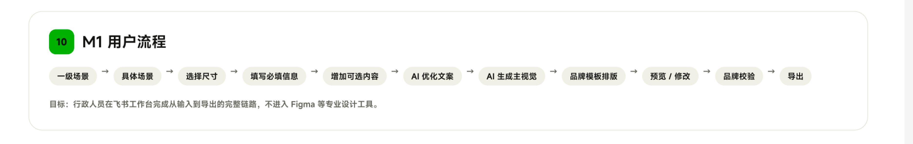
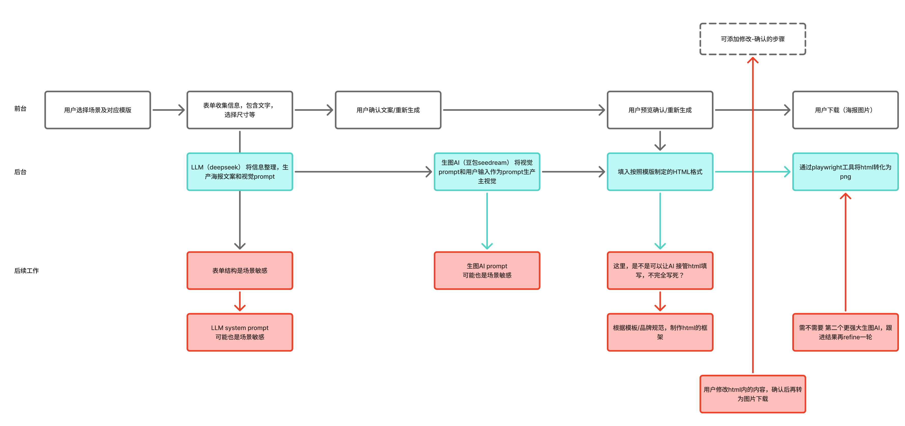

# 行政智绘 M1 流程与产品机制审计

日期：2026-09-03

## 审计范围

- 设计方给出的 M1 用户流程。
- 用户在 Figma 中梳理的前台、后台与后续工作流。
- 当前 `codex/slice-demo` 分支已实现的员工活动单切片。
- 重点判断：产品认知是否偏移、闭环缺口、流程健康度与下一步优先级。

## 输入证据





## 总结判断

方向没有发生根本偏移。对“场景化输入、AI 只生成结构化文案和主视觉、固定模板完成排版、最终导出”的理解与项目原则一致。

需要纠正的是五个流程边界：

1. 场景、模板和尺寸不应合并为一次自由选择。场景定义信息协议，系统只提供兼容的模板与 Format。
2. 文案确认后再编译视觉 Brief；视觉 Brief 应基于已确认的语义快照，同时继续脱敏，不应只依赖最初输入。
3. AI 不直接填写或修改 HTML。运行时只把通过 Schema 校验的结构化数据绑定到预制模板插槽。
4. “预览/修改”不是一个步骤，而是三条明确分支：修改文案、只换主视觉、切换兼容模板/Format；每条都创建新版本。
5. 品牌校验必须是下载前的发布门，而不是结果页上的提示信息。

## 建议的目标流程

```text
进入飞书应用
  -> 选择一级场景
  -> 选择具体场景 / 传播目的
  -> 系统推荐并限制兼容模板与 Format
  -> 填写必填事实
  -> 按需补充可选内容与视觉意图
  -> AI 生成结构化文案
  -> 用户确认或修改可编辑文案
  -> 系统冻结已确认内容版本
  -> 条件分支：需要主视觉才编译脱敏视觉 Brief 并生图
  -> PosterDocument + 视觉资产绑定固定模板
  -> HTML/CSS + Playwright 确定性渲染
  -> 内容、品牌、技术三类校验
  -> 预览
      -> 修改文案：新内容版本并重新渲染
      -> 只换主视觉：新资产和输出版本
      -> 换兼容模板/Format：重新渲染与校验
      -> 可选精修：显式付费的二次生图
  -> 用户批准
  -> 导出 / 飞书通知
```

## 流程健康度

| 维度 | 健康度 | 判断 |
|---|---:|---|
| 方向与系统边界 | 8.5/10 | AI、模板、排版职责分工正确，两阶段生成也避免了无效生图成本。 |
| 场景与信息架构 | 6/10 | 一级场景清楚，但“具体场景—字段协议—模板—Format”的配置关系尚未产品化。 |
| 用户闭环 | 6/10 | 已有输入、文案确认、预览、下载和只换主视觉；缺最终文案返修、批准和历史版本选择。 |
| 品牌与内容质量门 | 4/10 | 当前校验结果不阻止 `READY_FOR_REVIEW` 和下载，且尚未检查渲染后的几何、字体、二维码与像素结果。 |
| 任务可靠性与恢复 | 4.5/10 | 有状态、幂等键和版本记录；但仍是进程内异步与本地 JSON，刷新恢复、并发写、进程中断恢复不足。 |
| 可用性与可访问性 | 5/10 | 表单标签和文案较清楚；长表单、阶段焦点、动态状态播报、死导航和错误恢复仍需验证。 |

综合判断：概念闭环约 8/10，当前局域网试点闭环约 5.5/10，整体约 6.5/10。可以继续试用和验证方向，但还不适合被定义为“健康的可运营 M1”。

## 当前分支与目标流程的对应关系

1. 场景进入 — 偏黄。界面展示四个一级场景，但只开放员工活动；具体场景目前仍是普通表单字段，而非版本化场景配置。
2. 信息填写 — 偏绿。必填事实、列表、多场次、二维码和视觉意图已有结构化输入，且不可改写字段边界清楚。
3. AI 文案 — 偏绿。文案生成与 Schema 校验已跑通，且先生成文案、不立即产生图片费用。
4. 文案确认 — 偏绿。允许编辑标题、副标题、摘要、亮点和参与方式，事实字段由系统回填锁定。
5. 视觉 Brief 与生图 — 偏黄。运行时顺序正确，但视觉 Brief 仍使用最初输入，没有吸收用户确认后的标题与摘要；图片失败有降级资产。
6. 模板合成 — 偏绿。AI 不写 HTML，系统用固定模板和 Playwright 生成 PNG，职责边界正确。
7. 成品校验 — 偏红。当前只做少量文案一致性和长度检查，校验失败仍进入可预览、可下载状态。
8. 预览与修改 — 偏黄。已有预览和只换主视觉；缺成品文案返修、模板/Format 切换、版本对比与回退。
9. 批准与导出 — 偏红。当前下载等同于导出，没有独立的批准动作、发布门和导出审计状态。
10. 飞书结果回流 — 偏红。登录正在联调，机器人完成通知和结果卡片尚未接入。

## 最高优先级工作

### P0：先把闭环做正确

1. 锁定第一个二级场景的场景契约：必填、选填、不可改写、AI 可编辑、传播目的、兼容模板和 Format。
2. 锁定正式模板契约：插槽、字数上限、溢出策略、视觉焦点区、Logo/二维码安全区、缺字段重排和降级资产。
3. 把校验升级为发布门：错误不得进入可批准/可下载状态；警告需要用户明确知情确认。
4. 增加成品阶段的结构化文案返修，修改后创建新内容/输出版本；绝不让用户或 AI 编辑 HTML。
5. 让视觉 Brief 使用“已确认内容快照 + 脱敏场景事实 + StylePack”，并记录来源版本。

### P1：让局域网试点可恢复、可判断

1. 增加独立的 `APPROVED` 与 `EXPORTED` 状态，并记录批准人、批准版本、导出规格与时间。
2. 增加任务历史、继续未完成任务、版本缩略图与版本选择；导航中未实现的入口不要伪装成可用功能。
3. 将任务执行从 Web 进程内调用拆到可恢复 Worker；至少解决 JSON 并发写、进程重启丢任务和失败重试。
4. 明确等待时间、预计费用、降级状态、失败原因与下一步动作；图片生成期间允许离开并由飞书通知结果。
5. 做 5–10 名行政专员的任务测试，记录完成率、首次通过率、文案修改次数、换图次数、总耗时和最终放弃点。

### P2：验证后再扩展

1. 机器人主动完成通知和结果卡片。
2. 兼容模板/Format 切换。
3. 显式的“精修主视觉”二次付费操作。
4. 其他一级场景、多语言、PDF 和更多尺寸。

## 不建议现在做

- 不要让 AI 直接生成或填写 HTML。
- 不要把“第二个更强图片模型精修”放进默认主链路。
- 不要在首个二级场景和正式模板契约未稳定时批量扩场景。
- 不要把模型成功、页面可下载当成品牌校验已完成。

## 可访问性与证据限制

- 从代码可见，动态任务状态和错误信息尚未看到 `aria-live` 等播报机制；需做键盘和读屏实测。
- 场景卡的选中状态主要依赖视觉样式，建议补充语义状态；装饰图标应避免被读屏重复朗读。
- 文案确认区域在长表单底部动态出现，需验证焦点是否被引导到新阶段。
- 当前本机入口强制飞书登录，审计运行没有可用的测试 Session，因此本报告没有把当前产品页面截图当作完整视觉或无障碍合规证据；结论主要基于用户提供的两张流程图、当前分支源码和项目文档。

