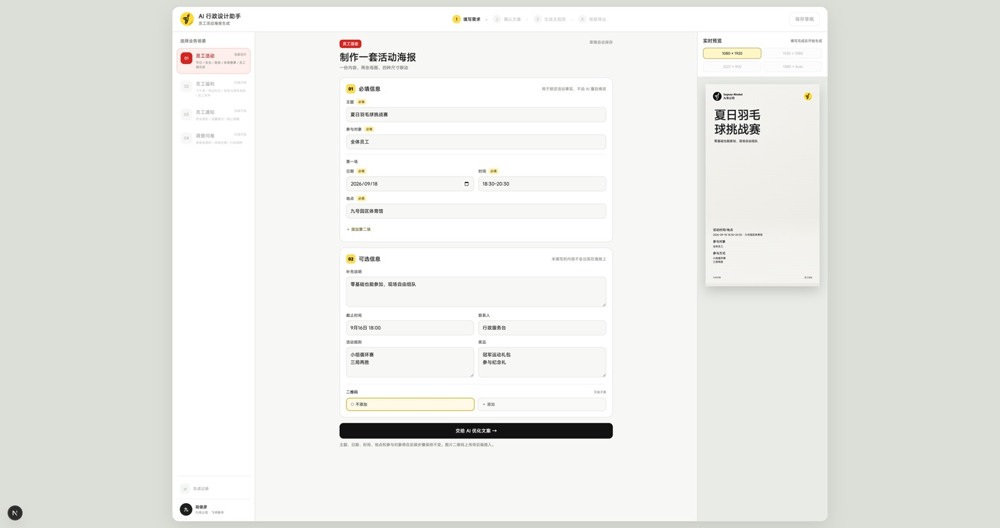

# Demo 实施复核与修改指导

日期：2026-09-04。审查基准：`codex/slice-demo`，最后核对提交 `1d4fe9a`。

范围：3000 端口实际入口、已有任务恢复、当前源码与 `docs/DEMO_UI_VISUAL_HANDOFF_2026-09-04.md` 的一致性。本次只审查、记录问题，没有修改业务代码或提交新任务生图。

下一轮执行入口： [修改任务清单](../.design/demo-review-2026-09-04/TASKS.md)。包含用户追加的 `brief.composition` 超过 420 字错误，执行顺序以该清单为准。

## 结论与证据边界

四步界面与视觉确认接口已接入，但还不能作为稳定的同事试用版交付。优先修复导航和状态恢复，再修复确认内容、生成容量、试用下载；随后处理视觉草稿、二维码及质量提示。

- 已登录的 `http://10.6.4.183:3000/` 实际打开正常，显示 Step 1。未观察到裸入口无限重定向。
- 带 `job` 链接进入视觉输入阶段已通过浏览器可访问性树确认。继续检查时原生截图连续返回纯灰画面、点击未产生可验证变化，因此没有把后续返回操作写成“已实测复现”。下面涉及这些操作的结论来自明确的代码分支。
- 首次看到旧标签停在“准备优化画面描述”；检查期间出现提交 `1d4fe9a`，补上 Worker 对 `REFINING_VISUAL` 的接受条件。该根因已修复，不列为当前待修缺陷。对遗留卡住任务仍需明确恢复策略。
- 本地任务 `484e3bee-5568-4b02-bc4f-be355dd05cbc` 的真实错误为 `brand.title.max_lines`；输入和文案标题均为默认示例“夏日羽毛球挑战赛”。本次仅只读检查该任务，没有创建它。
- 没有发现已落盘的 `passed=false / exportAllowed=true` 成品，因此试用下载缺陷按接口代码确认，未冒充真实下载实测。
- 检查期间另有提交和任务变化；执行修改前先重新读取 HEAD、工作区与目标文件，保留其他 agent 的更改。

有效入口截图（已保存并重新打开确认）：

截图中的整体显示比例可能受当前浏览器缩放影响，本次不据此判定字体尺寸不合格。后续纯灰截图不作为产品白屏的证据。

## 1. P1：当前步骤与任务阶段混用，造成跳转、返回死路和恢复错误

位置：`src/components/activity-studio.tsx:60–92、142、154–161`；`src/app/api/jobs/[jobId]/confirm-copy/route.ts:52`。

具体问题：

1. 初始 `stage=1`，读取 `?job=` 后才由 effect 跳到任务阶段。没有“正在恢复任务”状态，会先显示默认表单，再切到另一步。
2. 状态映射遗漏 `GENERATING_ASSET / RENDERING / VALIDATING_OUTPUT / FAILED_FINAL`。在生图期间刷新，主区留在 Step 1，而后台仍在执行；失败任务刷新也落到默认第一步。
3. 顶部导航用 `number <= stage` 判断可达性。进入 Step 3 再返回 Step 2，Step 3 立刻被禁用；当前正在看的页面被误当成了任务进度。
4. 新打开一个处于视觉阶段的任务时，`hydrateJob` 没有恢复 `copyReview`。返回 Step 2 会一直显示“正在生成文案”，即使 `copyDraft` 已存在，而且该状态不会触发文案轮询。
5. 如果先前走过 Step 2，返回时虽然有表单，但“确认文案，进入主视觉”仍调用仅接受 `READY_FOR_COPY_REVIEW` 的接口，得到 409。没有区分查看已确认内容与重新提交编辑。
6. 自动跳转 effect 依赖整个 `job` 和 `visualDescription`。轮询更新可覆盖用户主动返回；编辑或清空视觉描述也会触发导航/回填。
7. 查询任务的 401/403/404 被静默忽略，网络异常未捕获；用户可能看到无关默认值或持续等待。

修改指导：

- 分开维护 `viewStep`、服务端 `job.status` 和“可访问步骤集合”；不引入新状态机依赖，纯函数映射加 reducer/hook 即可。
- 初始有 job 参数时先显示恢复态，一次性恢复原始输入、文案、视觉输入、草稿和默认页面，再展示表单。
- 明确状态表：文案排队/生成→Step 2 进度；视觉输入/优化/确认/生图/渲染→Step 3 对应子状态；完成→Step 4；失败→失败步骤与可执行恢复动作。
- 自动导航仅响应首次恢复及确定的任务状态转换；同状态轮询不改用户当前视图，文字编辑不触发导航。
- 返回已确认文案时默认只读查看并提供“继续主视觉”。修改事实按既定计划创建新任务；重新确认可选文案需明确修订动作、更新来源版本并使旧视觉草稿失效。
- 增加请求 pending、错误与重试状态；轮询防止重叠和旧 job 响应覆盖新 job。401 提供重新登录，404 明确“任务不存在”。

验收：逐个任务状态刷新；Step 3→2→3 不产生 409、不永久加载；同状态轮询不抢导航；失败、失效链接、断网均有明确结果。

### 登录跳转的另一处缺口

`src/app/page.tsx:7` 登录前跳转没有保留原始 job 地址；`src/app/api/auth/feishu/callback/route.ts:38` 回调固定回 `/`。因此会话过期时从任务深链接登录，任务上下文会丢失。应在 OAuth state 关联的服务端/受保护状态中保存允许的站内 returnTo，回调恢复原任务；不要放开任意外部跳转。此项是代码确认，未退出用户账号实测。

## 2. P1：新任务复用旧任务的编辑状态

位置：`src/components/activity-studio.tsx:75、97–107`。

返回 Step 1 修改事实再提交时，只更新 jobId/job，未清空 `copyReview / visualDescription / visualIdea`。新文案到达时用 `current ?? newDraft`，旧文案继续保留；旧视觉描述也可能继续保留。结果是新活动带着上一活动的编辑内容继续生成。

修改指导：为任务编辑态建立明确的 jobId 边界；新任务成功创建后原子重置旧任务的草稿、错误和视觉状态。草稿只按匹配的 jobId 和草稿版本初始化，不靠“字符串是否为空”判断是否同步。

验收：同一标签完成 A 的文案确认→返回创建 B，B 的事实、文案和视觉输入不残留 A；延迟到达的 A 请求不会覆盖 B。

## 3. P1：用户确认的文案没有成为唯一输出来源

位置：`src/components/activity-studio.tsx:56–58、113、176`；`src/app/api/jobs/[jobId]/confirm-copy/route.ts:65–78`；`src/templates/employee-activity.ts:863`。

- “补充说明”编辑的是 `summary`，提交仍保留旧 `subtitle`。预览使用旧 subtitle，最终模板优先渲染 `subtitle || summary`。因此用户修改说明后，图片可能仍显示旧说明。
- 确认接口在展开用户内容后，又用 `input.rules / input.prize` 覆盖用户编辑。参与方式数组可能保存了新规则，但 `rules` 字段仍是旧内容，导致恢复前后不一致；奖品编辑直接丢失。
- 刷新表单使用 `copyDraft.document` 作为“原始输入”，因此优化前后对照的原文也会被替换。
- 标题虽在 UI 中只读，确认接口仍接受客户端 `title`，且没有覆盖/核验为 `input.activityName`；最终 `validatePoster` 也不检查标题相等。

修改指导：明确一份 canonical confirmed copy，原始事实表单读取 `job.input`；补充说明统一投影到顶部实际显示字段；规则只在确认边界进行一次结构化投影；保存奖品编辑值。对全部锁定事实在服务端逐字段校验，标题不能仅依赖只读控件保护。

验收：把说明、规则和奖品改成可辨识文本，确认、刷新、进入生成后值不回退；PNG 中显示确认后的说明和规则；直接提交篡改标题的请求被拒绝。

## 4. P1：标题容量在付费生图之后才失败

位置：`src/components/activity-studio.tsx:181`；`src/app/api/jobs/route.ts:12`；`src/templates/employee-activity.ts:240–275、847`。

前端允许 24 字，T01 实际为 690px 宽、120px 字号、单行限制；右侧草稿预览又允许显示两行。默认九字标题已经在真实任务中触发 `brand.title.max_lines`，造成“预览看起来可以，最后却失败”。

修改指导：复用 T01 的字体/字重/可用宽度做模型调用前容量检查，服务器也必须执行，不能只改前端常量。预览与输出共享容量规则，超限在 Step 1 明确提示。按既定范围保留单行标题，不自行缩字号、截断或改成双行；默认示例也要通过同一检查。

验收：默认示例可走通；长中文、中英文混排在调用模型前得到准确提示；无重要文字静默截断。先用本地 fixture 检查，无需为容量测试付费生图。

## 5. P1：trial 成品仍会被图片接口拒绝

位置：`src/worker/run-job.ts:176–198`；`src/app/api/files/[...path]/route.ts:26–39`；`src/components/activity-studio.tsx:145`。

Worker 正确区分 `validation.passed` 与 `exportAllowed`，但图片接口对 Artifact 和旧 Version 都只接受 `validation.passed`。对比度未通过但允许试用下载的版本会返回 404；同一个 URL 又用于预览，导致图片也不可见。

修改指导：按具体版本的 `exportAllowed ?? passed` 判断输出访问资格，保留所有者、文件归属及硬错误限制，不能读取全局 trial 设置追溯放开旧版本。UI 中禁止下载应真正禁用链接，而非只把文本改成“下载不可用”。

验收：同用户的 trial 警告成品可预览、下载；strict 失败/硬检查失败不能下载；旧通过版本仍可访问；他人访问仍被拒绝。还需确认运行服务确实配置了 `READABILITY_MODE=trial`：源码默认 strict，本次没有验证运行进程最终环境值。

## 6. P1：视觉草稿版本与用户输入脱节，“只换主视觉”也存在状态冲突

位置：`src/components/activity-studio.tsx:76–92、118–137、158–161`；`src/app/api/jobs/[jobId]/regenerate-asset/route.ts`；`src/app/api/jobs/[jobId]/confirm-visual/route.ts:35–44`。

- 改动原始视觉想法不会使旧草稿失效，可直接确认旧描述。
- 再次优化后，仅在 `visualDescription` 为空时采用新结果，因此可出现“新草稿时间戳 + 旧描述”。清空输入又会被 effect 自动填回。
- 恢复任务不读取已保存的 `visualInput.originalIntent`，刷新后画面想法为空。
- “只换主视觉”接口保留草稿但把状态改为 `READY_FOR_VISUAL_INPUT`。前端因此能显示可点击的最终确认按钮，而确认接口只接受 `READY_FOR_VISUAL_REVIEW`，点击后 409。

修改指导：绑定 `jobId + contentVersion + visualInputVersion + visualDraftVersion`，允许用现有时间戳建立一致的版本标识，但每次更新必须匹配。原始想法变动使草稿 dirty 并禁用确认；优化成功显式安装新草稿。只换主视觉时恢复上次最终确认描述，并让接口状态与可用按钮一致；重生后保留旧结果。

验收：改想法后不能确认旧稿；再优化展示新稿；可清空编辑框；刷新恢复已提交想法；只换主视觉不需要通过无说明的 409 来发现额外步骤。

## 7. P1：确认后的视觉描述未经二次脱敏，风格兜底仍会相互冲突

位置：`src/worker/run-job.ts:91–96、140`；`src/providers/prompt-compiler.ts:151–175、183–198`；`src/providers/illustration-provider.ts:33–44`。

`briefFromConfirmedDescription` 把完整用户描述放进 composition，直接传入图片 Prompt，没有脱敏调用；用户在确认框补入日期、电话、地点或文字要求，会进入图片模型。前一轮优化也只传 category/themeKeywords/visualIntent，既没有用已确认内容的脱敏语义，也没有提供原始事实给本地确定性过滤器。

本地优化 fallback 固定摄影且明确排斥插画，与用户指定插画的 setting 可能冲突；最终仅用关键词判断风格，也可能把“不要卡通”判为插画。

修改指导：从已确认内容构造允许的脱敏语义，隔离原始事实；确认后、图片调用前再次执行确定性过滤并注入受控约束。保留用户明确选定的风格，否定词和本地 fallback 同样遵守。不要为了这次修复新增模型调用或复杂风格库。

验收：使用虚构日期/电话/地点/二维码链接的测试描述，最终 Seedream prompt 不含这些字段；插画、摄影、否定卡通、本地兜底路径的风格一致；Step 3 优化不调用图片模型。

## 8. P1：并发确认没有原子性，重复点击可重复启动模型

位置：`src/components/activity-studio.tsx:97–131`；`src/app/api/jobs/[jobId]/confirm-visual/route.ts:28–63`；`src/server/job-store.ts:46–48、182–201`。

按钮没有覆盖请求开始到响应返回的 pending 锁，每次调用又创建新幂等键。服务端“读取状态→检查→更新→启动 Worker”不原子；两个并发请求可同时通过检查，Worker 也能同时读到允许状态。整个 jobs.json 的读取/写入还可能互相覆盖。

修改指导：同一用户动作重试复用幂等键，前端立即锁定动作；服务端把状态条件、幂等检查与任务认领合并成原子操作。当前单进程 JSON demo 可先使用统一存储串行化和原子替换写入，不能只在某个路由加局部锁；若要升级为多进程持久队列，应另行评估，不在此轮无边界扩建。

验收：用 mock Provider 并发调用确认接口，图片 Provider 只调用一次；同键重试返回同结果；不同任务并发更新不丢记录。不要用真实付费模型做这项压力测试。

## 9. P2：质量面板仍不是实际检查结果

位置：`src/components/activity-studio.tsx:163–168`；`src/worker/run-job.ts:183–191`。

面板用 `/字体|Logo/` 匹配 messages 判断失败，而 Worker 每次都会追加包含“Logo primary/inverse”的正常可读性说明，因此正常成品也会被标为“字体与双 Logo 资产未通过”。尺寸检查则固定 true。

修改指导：输出结构化检查项（标识、状态、证据），UI 直接映射；没有实际数据的检查隐藏或标“未检查”，不能通过文案关键词反推。区分 blocked/warning/pass/not_checked，保留真实对比度警告。

验收：正常 Logo 检查不会误报；无检测数据不显示通过；trial 警告与整体状态一致。

## 10. P2：表单与产品承诺还有原型残留

位置：`src/components/activity-studio.tsx:144、149–152、176、188–190`；`src/providers/copy-provider.ts:33–40、64–71、210–215`。

- 二维码仍有“上传二维码图片”，但只存文件名，没有上传/识别/持久化，违反本期 URL-only 决策。选“不添加”不会清除已填 URL，提交仍带二维码。
- “一份内容、两张母图、四种尺寸联动”和“草稿自动保存”仍在初始页上承诺尚未实现的能力。其他尺寸虽已禁用，应明确“后续开放”。
- 截止时间、联系人、奖品在 Step 1 填写时没有就地说明本竖版不展示，要到 Step 2 才知道。
- 可选项全空仍调用文案模型；旧 prompt 要求优化标题、补足亮点/参与方式，且本地 fallback 总会生成固定 subtitle，未落实“不填不造、全空跳过模型”。草稿预览也会显示占位说明和空参与方式标题。
- 字段 label 与 input/textarea 未通过 htmlFor/id 关联；浏览器树中的输入缺少可靠的字段名称。需补关联并检查键盘与焦点恢复；本次没有声称完成读屏或手机适配验收。

修改指导：移除图片上传；“不添加”统一清理 payload/预览状态，按同一标准判断非空 URL；文案按当前单竖版能力改写；未展示字段在填写处说明；空内容全链路保持为空；补齐字段可访问名称。

## 11. P1：构图约束重复拼接，合规描述在生图后触发 420 字校验失败

用户追加报错：`too_big / maximum: 420 / path: ["brief", "composition"]`，对外显示 `GENERATION_FAILED`。本次读取本地任务 `c63cb98d-d4ab-4886-ab81-2b91f9073fe0`，确认存在相同错误。

位置：`src/contracts/poster.ts:152–174、208–212`；`src/providers/prompt-compiler.ts:169–175、183–198`；`src/worker/run-job.ts:214–226、292–315`。

原因：

- 确认描述允许 420 字，`briefFromConfirmedDescription` 又拼接分隔符和 236 字的固定 T01 构图约束；最大变成 657 字，但 `illustrationBriefSchema.composition` 仍最多 420 字。当前实现只容得下 183 字的确认描述。
- 优化路径先校验 AI brief，再追加系统构图约束；追加后的对象没有在该边界重新校验。
- `visualDescriptionFromBrief` 又将带系统约束的 composition 展开给用户；正则只试图移除开头短语，固定坐标和安全区仍进入可编辑描述，最终确认时再追加一份约束。AI 返回的可编辑描述本身也可能超过确认接口上限。
- `visualMasterSchema.parse` 位于图片生成和渲染之后，导致已经完成外部调用才因内部元数据不合法失败。`failJob` 直接展示原始 Zod JSON，不提供可操作的恢复提示。

修改指导：用户创意描述、受控结构化 brief、系统模板约束分开存储和编译；系统约束只在最终图片 prompt 组装处注入一次，不进入用户编辑框。各字段使用自己的明确容量，编译后的最终载荷在图片调用前校验。保留 420 字用户描述预算；不要只提高 composition 上限，也不要 `.slice(0, 420)` 静默丢失创意或安全区要求。错误转换为稳定错误码和中文操作提示，保留输入及可重试状态。

验收：183、184、419、420 字描述能通过新链路；421 字在确认入口友好阻止；含系统约束的旧草稿可安全读取和转换、不重复注入；模型输出过长能恢复且图片 Provider 调用次数为 0；合法生成不再在保存 visualMaster 时因长度失败。

## 建议执行顺序与代码职责

1. **先修 1、2：导航和恢复。** 抽出 `useActivityWorkflow`（或同等 hook）管理任务载入、动作、轮询、恢复、版本归属；四个 Step 组件只消费视图数据与回调。把当前超长单行 JSX 格式化，便于逐处审查。
2. **再修 3、4：确认事实与内容投影。** 在契约/服务层定义原始事实、可编辑文案、已确认内容的边界；模板层提供容量规则，预览复用。不要让 UI 分别拼几套内容。
3. **接通 5、6、8：视觉任务与输出访问。** 服务层统一动作状态转换、幂等认领；文件接口读取具体版本资格。
4. **补齐 7、9、10：Prompt 边界和试用提示。** Provider 只接收受控视觉输入；质量 UI 展示真实检查；移除假功能。
5. **完成下面的验收，再发送试用入口。** 每次只交付一个可验证修复块，记录提交，不重做布局设计或混入消融实验。

不需要先换框架、增加状态机依赖、接新模型、实现四尺寸或扩建自由编辑器。

## 验收与本次实际检查

本次执行通过：`npm run typecheck`、`npm test`（11 个文件、45/45）、`npm run lint`。现有测试主要是 Schema、Provider 边界、模板与规则单测，没有覆盖上述新流程的 UI 状态转换和接口集成。通过这些检查不等于四步流程已验收。

本次未执行：生产 build、完整新生图链路、trial 成品实际下载、手机与读屏检查、清除会话后的 OAuth 全流程。未为审查重启/替换正在运行的服务。

执行 agent 必须补充：

- [ ] 每个后台阶段刷新恢复、返回与继续；无任务、无权限、断网、失败恢复。
- [ ] 同标签 A→B 新任务隔离；文案与视觉草稿的版本切换不混用。
- [ ] 可选全空不调用文案模型，输出无编造内容；文案编辑后刷新与 PNG 一致。
- [ ] 标题容量在外部模型前校验；单场/双场、有/无二维码均可用。
- [ ] 再优化、旧稿失效、只换主视觉和并发确认（mock Provider）。
- [ ] trial 警告可下载、strict/硬错误阻断、旧版本与所有者隔离。
- [ ] 生产构建通过后，完整跑一条真实任务并检查 PNG，再发局域网试用链接。

本审查文档作为原 handoff 的修复补充，不把尚未执行的修改标为完成。
